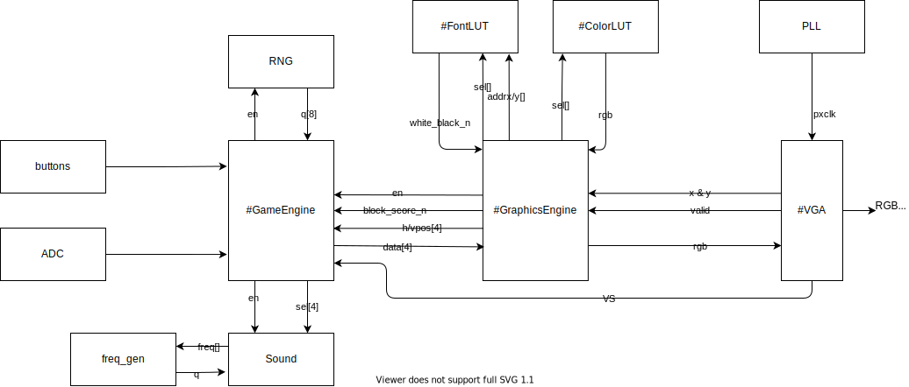

# Overview

Design and build a simplified “Tetris”-style video game using the DE10-Lite FPGA board and a VGA monitor.
The requirements for this project were:
1. The digital design must be done in VHDL.
2. The game image shall be 640 pixels wide by 480 pixels tall.
3. The two push buttons on the DE10-Lite board shall control game play. One button resets the game, the other starts the game.
4. Upon reset, a U-shaped enclosure with internal dimensions of 288 pixels wide by 448 pixels high shall be drawn with 1-pixel-wide white lines, 
centered roughly-horizontally on the screen. To the right of the enclosure 6 digits of score should appear in a white font, sized appropriately.
5. Areas of the screen not specified in requirement 4 shall be initially black.
6. When the “start” button is pressed a 32-pixel by 32-pixel cube will drop from the top of the screen. The color of the cube shall be randomly-generated 
from the set of {red, blue, green, yellow}. Pick an appropriate rate of movement for the cube to make the game challenging.
7. The user can move the cube from side-to-side inside the U-shaped enclosure as it descends. The cube movement can be controlled by either a potentiometer 
interfaced to the FPGA’s ADC, or via the on-board accelerometer. As the enclosure is the exact width to hold 9 cubes, the horizontal position of any cube 
should always be in one of the 9 “lanes”. Cubes must remain inside the enclosure at all times.
8. The cube continues to descend until it is resting on top of either (1) the bottom of the enclosure or (2) an already-stationary cube. If the cube comes 
to rest with it’s top within 2 cube heights of the top of the screen, the game is over. When the game is over, no additional cubes should appear and the 
score for the game should remain visible until the reset button is pressed.
9. If at any point in time there is a horizontal or vertical sequence of at least 3 stationary cubes of the same color, those cubes will disappear and any 
higher cubes will fall down to fill in the gaps. 1 point should be added to the displayed score for each cube that disappears. If the rearranging causes more 
sequences of 3 or more, those cubes should also disappear. The object of the game is to maximize the score.
10. Once all remaining cubes are stationary, the next cube begins its descent from the top of the screen.
11. Produce 4 unique sounds using the FPGA and an external speaker/buzzer. One when a cube is moved a slot to the left or right, one when a cube
becomes stationary, one when a set of 3 or more cubes disappears, and one when the game is over.

# Procedure

The design was divided into three main submodules: GameEngine, GraphicsEngine, and VGA.
The GameEngine handled the movement of blocks within the enclosure, the position of static blocks, and the player's score.
The enclosure was constantly scanned for any "floating" blocks, or blocks that were not stationary on another block or at the bottom of the enclosure.
Once all blocks were found to be stationary, the enclosure was then scanned for any horizontal or vertical sequence of 3 cubes of the same color.
Sequences of 3 cubes of the same color were cleared from the screen, the score was incremented, and the scan for floating blocks resumed.
This search pattern continued until it was determined that there were no floating blocks or sequences of 3.
After the scan, the game would check if there were any blocks within two spaces of the top of the enclosure to determine if the game was over.
If the game was not over, a request was sent to the RNG for the color of the next falling generated.
The block movement between the 9 lanes were determined from the input of the ADC.
The 4 MSB were taken from the ADC input vector and values 0 through 8 were assigned to each respective lane. 
The block stayed in the right-most lane for input values greater than 8.

Difficulties with the GameEngine mostly consisted of data structures.
A two dimensional array was used to track block positions within the enclosure. 
While scanning the array for blocks to descend and clear, much attention was needed when indexing these positions.
Much testing was done using ModelSim to check whether blocks were descending correctly and were cleared when intended.
Before moving a block, the next space needed to be checked as to whether it was already occupied by another block.
When passing a block color from the GameEngine to the GraphicsEngine, the color was given a code value.
To distinguish between the single, falling, controllable block, a '1' was appended to the code which was removed once it became stationary.

# Results

Initial tests on the monitor showed a stack of various colors on the far left edge of the enclosure.
The rate of descent needed to be adjusted, but this showed that the game ended once the stack of blocks reached the top of the screen.
After decreasing the rate of block descent, blocks were seen to be falling on the left edge of the screen.
Once the ADC was implemented, the blocks could be moved horizontally as they fell. 
Three consecutive colored blocks were removed correctly from the screen.

The score would not display properly.
A series of zeros would display, but when sending other numbers the score would print several numbers in one position.
The sounds were not implemented as the majority of design time went into displaying the game and making the game functional.
The ADC was trivial to implement as the design was brought from a previous lab.
The RNG worked as expected, implementing a pseudo-random number generator. 

# Conclusion

